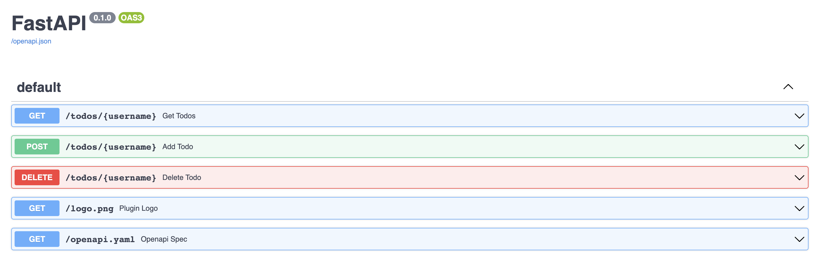

HybridTales Plugin for ChatGPT

This is a much more complicated verssion of a demonstration plugin I posted here:
[https://github.com/cybershrapnel/chatgpt-plugins-fastapi-quickstart](https://github.com/cybershrapnel/chatgpt-plugins-fastapi-quickstart)
If you find anything too complicated in this project then check out the old repo for educational purposes as it is a great place for anybody to start in regards to building a plugin.

What Does This Plugin Do?
1. Perform Web Queries with huge token input counts (too large, I don't know why it is even allowing it lol)
2. Pull full length Tales from the HybridTales website, optionally use them to tell a new story based on that one or combine it with other stories to unravel new ideas and mysteries. Or just read the story as it was published on the website.
3. Power Promnpts - Ask hybridtales to grab a random power prompt for you to try and experiment with. I promise you will be pleasantly surprised by the experience.
4. Avatar Personas - Ask chatgpt to load a an avatar from hybridtales and to embody that persona from the returned prompt. See what kind of answer batman gives you about your homework.
5. story list and todo list. The story list is a global todo list that stores any and all stories users create using the hybridtales plugin. We do not store any user input or data, but we do store the output from gpt that is a story before it get sent over the api and to you. Basically the hybridtale uses it's own ai to flag and catalog all of the stories it shares or creates, etc. Todo list items can be deleted stories are persistent and globally shared as one giant community list.
6. Story Search - YOu can search by story id, story title (eact match only), by author or by keyword. You can also have a list of random stories returned to you from the list which can then be used with prompting to do all sorts of things such as tell a new story or to power prompt the ai to produce new and unique output for whatever you are working on. You would be surprised by the output tha a good power prompt will yield even if it didn't initially make sense as a prompt.
7. If you want to be credited as author on any works put in the list you must tell chatgpt that you want to be author and what your author name is or the stories will be assigned to chatgpt or anonymous, etc. Chatgpt changed the API so plugins no longer have access to usernames which also means the todo list no longer functions as intended.
8. Many of our plugins APU functions can be accessed without even installing our API. for example, you can install the official linkreader app and then ask the linkreader plugin to acces one of our api endpoints such as [https://nanocheeze.com/tales/random](https://nanocheeze.com/tales/random)
By accessing that page with linkreader you are essentially loading in a random story into chatgpt and you can do the same thing with most functions of the HybridTales API. This could be useful for cases where you already have 3 plugins installed and don't want to deactivate one or even for double use cases with our plugin itself. ie, you can ask hybridtales to pull up it's own api against its own story generation with chatGPT.

You can access, view, and even interactively use our API from the following page:
[https://nanocheeze.com/docs#
](https://nanocheeze.com/docs#)

Here is a full list of API calls:

GET /scrape/
Scrape

GET /avatars/count_and_sample
Get Avatar Count And Sample

GET /avatars/{keyword}
Get Avatar

GET /stories
Get Stories

GET /prompts/random
Get Random Prompt

GET /tales/random
Get Random Tale

GET /stories/count
Get Story Count

POST /stories/{username}
Add Story

GET /stories/id/{storyId}
Get Story By Id

GET /stories/{storyId}
Get Story

GET /stories/search/{keyword}
Search Stories

GET /stories/author/{authorName}
Get Stories By Author

GET /todos/{username}
Get Todos

POST /todos/{username}
Add Todo

DELETE /todos/{username}
Delete Todo


How to install the plugin on OpenAI ChatGPT


And then make sure you enable the plugin after installation.


## Setup for your own plugin server

Clone this git into your desired location.

To install the required packages for this plugin, run the following commands to create a virtual environment and install the packages:

```bash
python -m venv venv
```
```bash
venv\Scripts\activate.bat
```
```bash
pip install -r requirements.txt
```

To run the plugin, enter the following command:
```bash
hypercorn main:app --bind 0.0.0.0:443 --certfile certificate.crt --keyfile private.key --log-level debug
```

or use uvicorn for localhost testing (can also use hypercorn with ssl on localhost)

```bash
uvicorn main:app --reload
```

To relaunch your server from a new window you will need to reactivate your virtual Python space.

Simply type:
```bash
venv\Scripts\activate.bat
hypercorn main:app --bind 0.0.0.0:443 --certfile certificate.crt --keyfile private.key --log-level debug
```

Once the local server is running:

1. Navigate to https://chat.openai.com. 
2. In the Model drop down, select "Plugins" (note, if you don't see it there, you don't have access yet).
3. Select "Plugin store"
4. Select "Develop your own plugin"
5. Enter in `localhost:443` if testing local or your domain name if live. Then select "Find manifest file".
6. Must have SSL certs installed. I suggest getting a free 3-month ssl cert from zerossl for testing and experimentation.
*** You can run on port 8000 or 443 with some slight changes to code without ssl but I would not recoment it and it's easier to just setup the ssl from the start as this is setup for it. Comment out line in file and comment the other one. This git is setup to run a localhost or a domain on port 443 for https access as required by OpenAI Plugins. You can use localhost without ssl only.

The plugin should now be installed and enabled! You can start with a question like "What is on my todo list" or "create a random story and add it to the stories list" and then try adding something to it as well! You can simply ask to see either list.

## Using the API via Swagger
[NanoCheeZe MEQUAVIS HybridTales API](https://nanocheeze.com/docs) - HybridTales API

You can access the API documentation and make queries using Swagger. Follow the steps below to get started:

1. You can run the project locally or from your domain to access the API. The API is interactive.
2. Open your web browser and visit [http://localhost/docs](http://localhost/docs). (or your domain instead of localhost)
3. On the API page, you'll find an interactive interface that allows you to explore and test the different API routes and endpoints.



